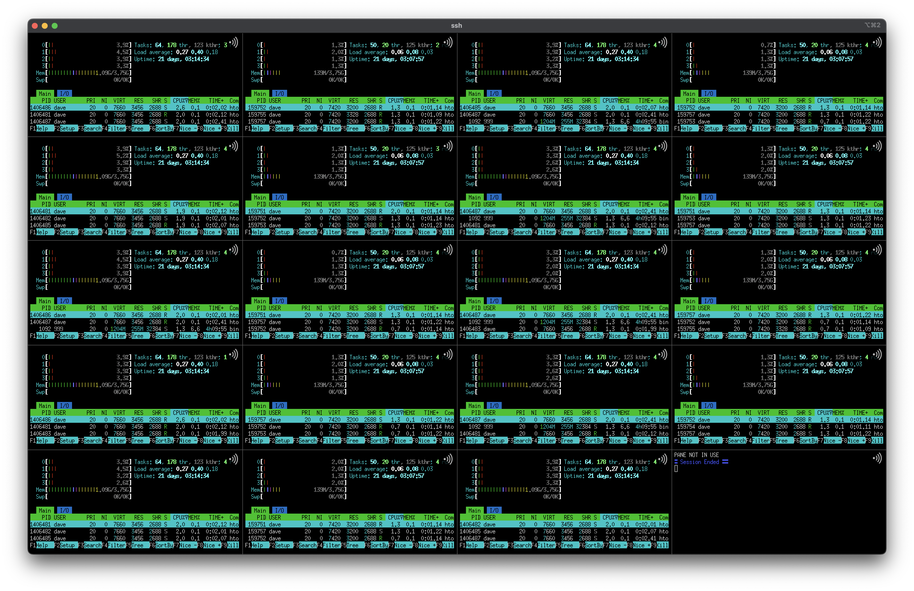

# csshi
A ClusterSSH utility (like [cssh](https://github.com/duncs/clusterssh)) for [iTerm2](https://iterm2.com/).

The command opens an iTerm2 Window and connects over ssh to each specified host in a [split pane](https://iterm2.com/features.html) session, with any text typed or pasted replicated to all panes through iTerm2's 'broadcast' feature by default. iTerm2's split pane controls are available as normal, so broadcast input can be toggled per-pane, sessions can be restarted, etc.



# Install

## Homebrew
* Install iTerm2 however you like.
* Install csshi:  
```$ brew install ilikejam/csshi/csshi```
* Enable the iTerm2 Python API at:  
`iTerm2` -> `Settings...` -> `General` -> `Magic`  
The 'Require "Automation" permission' option is OK.

## Manual
* Install iTerm2 however you like.
* Install python3 e.g. with [homebrew](https://brew.sh/):  
```$ brew install python3```
* Install the python iterm2 and pyobjc libs through pip:  
```$ pip3 install iterm2 pyobjc```
* Clone this repo (or just download the 'csshi' file), make the csshi file executable, and maybe copy or link it to somewhere in your $PATH.
* Enable the iTerm2 Python API at:  
`iTerm2` -> `Settings...` -> `General` -> `Magic`  
The 'Require "Automation" permission' option is OK.

# Usage  

```text
usage: csshi [-h] [-l USERNAME] [-p PORT] [-d] [-J JUMPHOST] [-o OPTIONS]
             [-C COLUMNS] [-k] [-b BINARY] [-s SLEEP] [-n] [-c]
             destination [destination ...]

Run multiple ssh connections concurrently in an iTerm2 terminal.

positional arguments:
  destination           [user@]host[:port] ssh server specification. Use
                        square brackets around IPv6 IP adresses.

options:
  -h, --help            show this help message and exit
  -l USERNAME, --username USERNAME
                        Login username, overridden per-host by specifying
                        'user@host'
  -p PORT, --port PORT  ssh server port, overridden per-host by specifying
                        'host:port
  -d, --debug           Turn on debugging
  -J JUMPHOST, --jump JUMPHOST
                        ProxyJump host specification, like
                        [user@]jumphost[:port]
  -o OPTIONS, --options OPTIONS
                        Raw ssh options string, e.g. '-i ~/.ssh/id_ansible'
  -C COLUMNS, --columns COLUMNS
                        Maximum number of columns.
  -k, --kill-inactive   Don't create spacer panes and kill inactive panes
  -b BINARY, --binary BINARY
                        SSH binary to use. Defaults to 'ssh'
  -s SLEEP, --sleep SLEEP
                        Sleep time in seconds between hosts. Defaults to 0
  -n, --no-broadcast    Don't enable input broadcast
  -c, --caffeinate      Try to keep the Mac awake
```

# Tips
If you have a file listing hostnames to connect to, use `xargs`:  
```$ cat file_of_hosts | xargs csshi```

Some preferences to optimise for shell density if you find yourself opening a lot of terminals in one csshi session:
* Disable pane menubars:  
`iTerm2` -> `Preferences...` -> `Appearance` -> `Panes` -> `Show per-pane title bar with split panes`  
You can still access the menu for each pane with Ctrl-click instead of the menubar burger icon
* Use a small font, like the original [misc-fixed 6x13](https://monkey.org/~marius/beautiful-fixed-width-fonts-for-osx.html), and disable antialiasing:  
`iTerm2` -> `Preferences...` -> `Profiles` -> `Text` -> `Anti-aliased`
* Decrease the 'Side' and 'Top & bottom' margins:  
`iTerm2` -> `Preferences...` -> `Appearance` -> `Panes`

If you are connecting to large numbers of hosts via a single Jumphost, it's advisable to set up multiplexing for the Jumphost:  
https://en.wikibooks.org/wiki/OpenSSH/Cookbook/Multiplexing  
Also consider raising MaxConnections on that host - the default on OpenSSH is 10.

# Contribute
Throw a PR over, raise an issue, send me an email.
